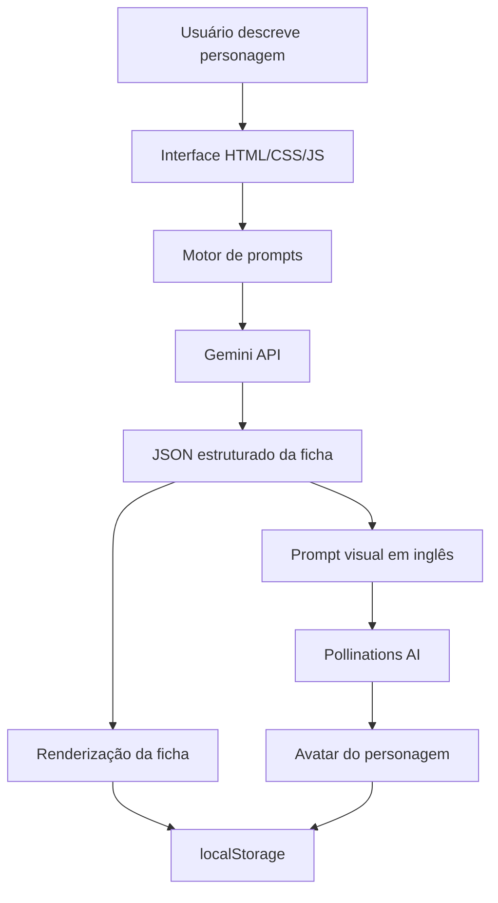

# Arquitetura do MVP

## Visão geral

O MVP foi organizado como uma aplicação estática para facilitar publicação em GitHub Pages. A arquitetura favorece simplicidade, portabilidade e facilidade de estudo pelos alunos.

## Camadas

```text
Usuário
  ↓
Interface Web Estática
  ↓
JavaScript de Estado e Renderização
  ↓
APIs externas de IA
  ↓
Retorno estruturado em JSON e URL de imagem
  ↓
Ficha interativa + armazenamento local
```

## Componentes principais

### 1. Interface

- Layout em Dark Mode.
- Painel esquerdo para entrada de dados e calculadora.
- Painel direito para a ficha do personagem.
- Abas de conteúdo.
- Botões de ação para editar, copiar JSON, exportar PDF e regenerar avatar.

### 2. Estado da aplicação

O estado global controla:

- prompt do usuário;
- estilo artístico;
- personagem ativo;
- histórico local;
- aba ativa;
- valores de HP, MP e XP;
- fórmula de dados;
- histórico de rolagens.

### 3. Geração textual

A aplicação envia uma requisição para a API Gemini com:

- instrução de sistema;
- descrição do usuário;
- schema JSON esperado.

O retorno é interpretado como ficha estruturada.

### 4. Geração visual

A aplicação constrói um prompt em inglês para o avatar e solicita uma imagem via Pollinations AI.

### 5. Persistência

O MVP utiliza `localStorage` para:

- histórico de fichas;
- histórico de rolagens;
- chave de API do usuário;
- códigos de recuperação locais.

Há previsão de Firebase opcional para sincronização em nuvem.

## Diagrama simplificado



## Observação sobre chaves de API

Chaves de API não devem ser versionadas no GitHub. O MVP permite que o usuário insira sua própria chave no navegador.
